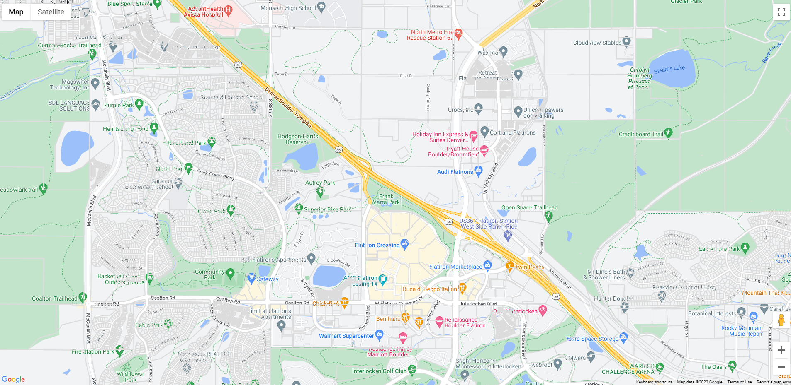

# google-maps-example
A basic google map with Lightbox tiles

# Get Started

1.Clone the .env.copy file to a .env file
    
        `copy .env.copy .env`

2.Paste your Lightbox API key into the .env file

        `LIGHTBOX_API_KEY="MY_LIGHTBOX_API_KEY"`

3.Start up the proxy server using nodemon

        `npm run dev`

4.Use something like live server to serve the html file found in the 'client' directory.

5.You should be seeing Lightbox tiles over the Google roadmap:

## Proxy Server
This example uses a 'proxy' server to handle authenticated requests to the Lightbox parcel tile endpoint. I couldn't figure out a way to authenticate using Google's built in image / overlay map types.
